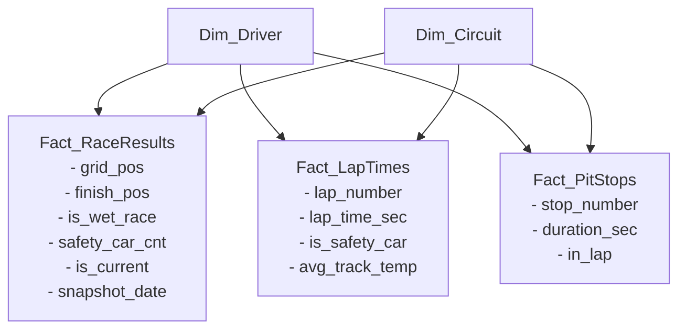

# Projekt: F1 BI Rendszer (Üzleti Intelligencia Házi Feladat)

## 1. Architektúra és Célok
- **Cél:** Teljes életciklusú BI rendszer Formula–1 adatokkal, megajánlott jegy célkitűzéssel.
- **ETL:** Low-code adatbetöltés (Pentaho PDI / n8n tervezve), automatizált, növekményes (delta) és csúszóablakos (sliding window) frissítéssel.
- **DWH:** PostgreSQL relációs adatbázis, Galaxy/Constellation csillagséma.
- **BI / Megjelenítés:** Power BI Desktop (összetett DAX mérőszámok, track affinity, steward audit trail).

## 2. Adatforrások
- **Jolpica-F1 REST API** (`https://api.jolpica.com/ergast/f1/`): Történelmi és futameredmények, köridők, rajtpozíciók, bokszkiállások.
- **OpenF1 API** (`https://api.openf1.org/v1/`): Telemetria, Safety Car fázisok (`/race_control`), pálya- és időjárásadatok (`/weather`).

## 3. Tervezett Adatbázis-séma (PostgreSQL)
- **Dimenziók:** `Dim_Driver`, `Dim_Constructor`, `Dim_Circuit`, `Dim_Season`, `Dim_Weather`.
- **Ténytáblák:** 
  - `Fact_RaceResults` (tartalmazza a grid/finish pozíciót, esős futam jelzőt, valamint audit trail / verziózást az utólagos FIA büntetések követésére: `is_current`, `snapshot_date`).
  - `Fact_LapTimes` (köridők másodpercben, `is_safety_car` flaggel ellátva).
  - `Fact_PitStops` (kiállások időtartama, kerékcsere ideje).

## 4. Főbb Elemzési Fókuszok (DAX & SQL)
- Időmérő determináltsága: Pályánkénti rajtpozíció-megtartás és győzelmi konverzió (grid vs. finish).
- Safety Car és extrém időjárás hatása a versenydinamikára és kiesésekre (DNF).
- Bokszkiállási konzisztencia csapatonként és a pozícióvesztés esélye elrontott csere esetén.
- "Zöld asztal melletti döntések": leintéskori sorrend vs. hivatalos FIA végeredmény eltéréseinek történeti elemzése.

## 5. Adatbázis Koncepció (Galaxy / Constellation Csillagséma)

A rendszer több ténytáblára épül, amelyek közös dimenziókon (pilóták, csapatok, pályák) osztoznak:

Főbb funkciók az ábra alapján:
- Fact_RaceResults: Rajthely vs. befutó elemzése, esős futamok és az utólagos FIA módosítások verziózása (is_current, snapshot_date).
- Fact_LapTimes: Tiszta versenytempó vizsgálata a Safety Car körök kiszűrésével (is_safety_car).
- Fact_PitStops: Bokszkiállási idők, csapatkonzisztencia és kerékcsere-stratégiák.