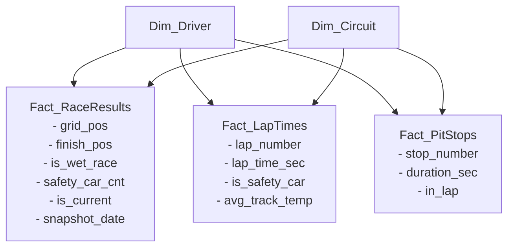

# Projekt: F1 BI Rendszer (Üzleti Intelligencia Házi Feladat)

## 1. Architektúra és Célok
- **Cél:** Teljes életciklusú BI rendszer Formula–1 adatokkal, megajánlott jegy célkitűzéssel.
- **ETL:** Low-code adatbetöltés (Pentaho PDI / n8n tervezve), automatizált, növekményes (delta) és csúszóablakos (sliding window) frissítéssel.
- **DWH:** PostgreSQL relációs adatbázis, Galaxy/Constellation csillagséma.
- **BI / Megjelenítés:** Power BI Desktop (összetett DAX mérőszámok, track affinity, steward audit trail).

## 2. Adatforrások
- **Jolpica-F1 REST API** (`https://api.jolpica.com/ergast/f1/`): Történelmi és futameredmények, köridők, rajtpozíciók, bokszkiállások.
- **OpenF1 API** (`https://api.openf1.org/v1/`): Telemetria, Safety Car fázisok (`/race_control`), pálya- és időjárásadatok (`/weather`).

## 3. Tervezett Adatbázis-séma (PostgreSQL)
- **Dimenziók:** `Dim_Driver`, `Dim_Constructor`, `Dim_Circuit`, `Dim_Season`, `Dim_Weather`.
- **Ténytáblák:** 
  - `Fact_RaceResults` (tartalmazza a grid/finish pozíciót, esős futam jelzőt, valamint audit trail / verziózást az utólagos FIA büntetések követésére: `is_current`, `snapshot_date`).
  - `Fact_LapTimes` (köridők másodpercben, `is_safety_car` flaggel ellátva).
  - `Fact_PitStops` (kiállások időtartama, kerékcsere ideje).

## 4. Főbb Elemzési Fókuszok (DAX & SQL)
- Időmérő determináltsága: Pályánkénti rajtpozíció-megtartás és győzelmi konverzió (grid vs. finish).
- Safety Car és extrém időjárás hatása a versenydinamikára és kiesésekre (DNF).
- Bokszkiállási konzisztencia csapatonként és a pozícióvesztés esélye elrontott csere esetén.
- "Zöld asztal melletti döntések": leintéskori sorrend vs. hivatalos FIA végeredmény eltéréseinek történeti elemzése.

## 5. Adatbázis Koncepció (Galaxy / Constellation Csillagséma)

A rendszer több ténytáblára épül, amelyek közös dimenziókon (pilóták, csapatok, pályák) osztoznak:

Főbb funkciók az ábra alapján:
- Fact_RaceResults: Rajthely vs. befutó elemzése, esős futamok és az utólagos FIA módosítások verziózása (is_current, snapshot_date).
- Fact_LapTimes: Tiszta versenytempó vizsgálata a Safety Car körök kiszűrésével (is_safety_car).
- Fact_PitStops: Bokszkiállási idők, csapatkonzisztencia és kerékcsere-stratégiák.

## 6. API Adatlefedettség (Postmannel tesztelve)

A `MRData.total` mező alapján ellenőrzött első elérhető szezonok:

| Adat | Első szezon | Forrás |
|---|---|---|
| Futameredmények, naptár, pilóták, csapatok, pályák, bajnoki állások | 1950 | Jolpica |
| Időmérő (qualifying) | 1995 | Jolpica |
| Köridők (laps) | 1996 | Jolpica |
| Bokszkiállások (pitstops) | 2011 | Jolpica |
| Időjárás (`/weather`), Safety Car (`/race_control`), gumikopás/stintek (`/stints`) | 2023 | OpenF1 |

- A Jolpica tesztelve van; az OpenF1 2023 előtti szezonokra nem ad adatot.
- A működő Jolpica host: `https://api.jolpi.ca/ergast/f1/` (a fenti `api.jolpica.com` helyett).
- Jolpica: minden érték string (típuskonverzió kell), alapértelmezett `limit=30`, maximum 100, `offset` lapozás. Nincs "last modified" mező.
- A 2023 előtti szezonoknál az `is_wet_race`, `safety_car_cnt`, `is_safety_car`, `avg_track_temp` értéke `NULL` (nem `false`/`0`), a riportokban jelezni kell, hogy az adat csak 2023-tól elérhető. Erre egy `data_coverage` tábla szolgál (adatkör, első szezon).

## 7. Tervezési döntések (eddig)

- **Gerinc:** a Jolpica az elsődleges forrás (azonosítók, naptár); az OpenF1 csak kiegészítő (időjárás, Safety Car, stintek).
- **Összekapcsolás:**
  - Futam ↔ OpenF1 session: Jolpica `date` = OpenF1 `date_start` dátumrésze (`session_name='Race'`, azonos `year`); az `openf1_session_key` a `Dim_Race` táblában tárolt.
  - Pálya: az OpenF1 `circuit_key` a `Dim_Circuit.openf1_circuit_key`.
  - Pilóta: 3 betűs kód (Jolpica `code` ↔ OpenF1 `name_acronym`) + szezon. A `permanentNumber` nem használható (pl. Verstappen: permanentNumber 3, de 1-es rajtszámmal versenyzett).
  - Csapat: csak a Jolpica `constructorId`.
- **Séma kiegészítések:** `Dim_Race` (season, round, date, circuit, openf1_session_key) és `Dim_Constructor` kell; a ténytáblák a `Dim_Race`-hez is kapcsolódnak.
- **Csapatnevek:** két réteg: constructor (Jolpica `constructorId`-nként egy sor) + franchise/lineage tábla alias-okkal (`valid_from_season`, `valid_to_season`). A kozmetikai átnevezések (szponzor) egy franchise-hoz tartoznak; a tulajdonosváltások (pl. Tyrrell → BAR → Honda → Brawn → Mercedes) esetén eseti döntés.
- **Staging réteg:** végpontonként egy staging tábla (nyers `jsonb` + `season`, `round`, `source_url`, `load_ts`, `run_id`), append-only; a feldolgozás SQL-ben külön lépés. `etl_run_log` tábla a futások naplózására és a folytatható betöltéshez.
- **ETL jobok (Pentaho, paraméterezett: `SEASON`, `ROUND`):**
  - **Job A (szezonális):** szezon kezdetén naptár, csapatok, pilóták, pályák, OpenF1 session-ök (`openf1_session_key` feltöltése); szezon végén végső bajnoki állások.
  - **Job B (futamhétvége):** eredmények, időmérő, köridők, bokszkiállások (Jolpica) + időjárás, race_control, stintek (OpenF1). Futam utáni 1-2. napon fut, és az utolsó N futam eredményét újratölti (csúszóablak), az FIA-büntetések követéséhez (`is_current`, `snapshot_date`).
  - A kezdeti feltöltés (backfill) ugyanezek a jobok egy szezon/forduló ciklusban; az egész legyen folytatható. A rate limiteket tiszteletben kell tartani.
  - Ütemezés: Kitchen parancssorból (Windows Task Scheduler / cron).
- **Audit trail korlát:** az `is_current`/`snapshot_date` csak az első betöltés utáni módosításokat tudja követni.
- **Állapot:** a PostgreSQL docker konténer (`db/docker-compose.yml`) kész és fut; a séma még nincs létrehozva.
- **Nyitott kérdés:** a backfill kezdete: 1996-tól minden (javasolt), vagy az eredmények 1950-től, a többi adat a saját kezdőévétől.

## 8. Döntés és séma állapota

- **Backfill:** 1996-tól minden adat (1. opció). A 2023 előtti időjárás/Safety Car mezők `NULL`-ok maradnak.
- **Séma:** `db/init/01_schema.sql` (a `db/docker-compose.yml` az `./init` mappát a `/docker-entrypoint-initdb.d`-be csatolja; csak üres adatkötetnél fut le automatikusan).
  - `etl` séma: `run_log`, `data_coverage` (a 6. fejezet adataival feltöltve).
  - `stg` séma: végpontonként egy nyers `jsonb` tábla (`jolpica_*`, `openf1_*`).
  - `dwh` séma: `dim_driver`, `dim_franchise`, `dim_constructor`, `dim_constructor_alias`, `dim_circuit`, `dim_season`, `dim_race`, `dim_weather`; `fact_race_results` (verziózott: `is_current`, `snapshot_date`), `fact_qualifying`, `fact_lap_times`, `fact_pit_stops`.
- **Következő lépések:** Pentaho extrakciós jobok (staging betöltés) → SQL transzformációk staging → dwh → Power BI.